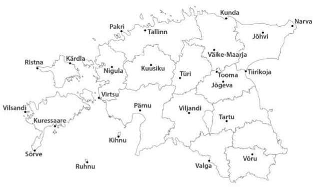
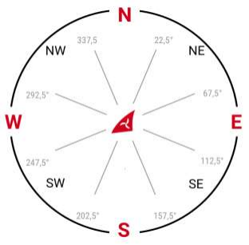
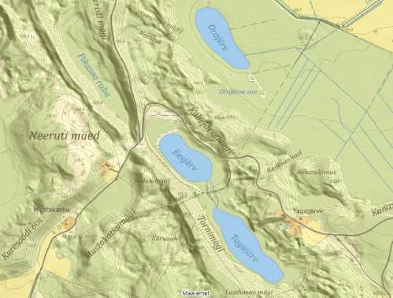

```{r setup, include=FALSE}
knitr::opts_chunk$set(echo = TRUE)
```

## Ül 1, **Ilmavaatlus**

### Ülesande püstitus

**Töö eesmärgiks** (lisaks sellele, et saada pisut värsket õhku) on avastada vajadus mõõtmisvahendite, väärtuse leidmise ja määrmaatuse hindamise järele meie vaatlustes.

Tuleb minna õue! Pole vaja mingeid instrumente - selles ülesandes saab piirduda vaid visuaalsete vaatlustega. Vasta järgnevatele küsimustele nii hästi kui oskad, aga ära looda välja tulla täpsete andmetega!

Märgi üles vaatluste koht, kellaaeg ja kuupäev!

a) Missugune on tuule suund? Kuidas Sa määrasid selle?

b) Kui suur on tuule kiirus ja kuidas Sa määrasid selle?

c) Missugune on temperatuur (Kasuta sõnu. Ära kasuta numbreid. Kasuta subjektiivseid termineid)

d) Nüüd püüa defineerida neid termineid, mida kasutasid just temperatuuri kirjeldamisel.

e) Missugune on õhurõhk? (Mis paneb Sind nõnda arvama?)

f) Missugune on Päikese kõrgus (Kui kõrgel kraadides on Päike horisondi kohal)?

g) Kui suur osa taevast (%) on pilvedega kaetud?

h) Kui kõrgel asetseb pilvede alumine piir?

i) Kui palju eri liike pilvi on taevas?

j) Kirjelda erinevaid pilveliike taevas.

k) Kuidas Sa hindad oma eelneate vastuste "täpsust"?

### Lahendus

Vaatluse koht: Harku alevik.

Kellaaeg: 1929.

Kuupäev: 20211202.

Vastan ülesande püstituses esitatud alamülesannetele:

a) Vaatasin puu oksi. Neid justkui tõugati minu poole. Minu rõdu avaneb lõunasse. Puu on kagus. Seega on tuule suund kagust loodesse.

b) Tuul on mõõduka tugevusega. Kuulen, et lipuvarraste rihmad plaksuvad vastu vardaid. Nõrga tuulega seda anomaaliat pole. Tugeva tuulega näeksin puude oksi rohkem liikumas.

c) Seisin paljajalu lumel. Külm oli.

d) seisma: püstises asendis viibima; paljajalu: ilma et jalalabad oleksid kaetud; lumi: kristalliseerunud, kuid ühtlasi hõre vesi; külm: mitte soe; olema: eksisteerima

e) Tundub, et õhurõhk on tavaline. Arvan nii, sest ei saja ja kui viimati valgel ajal vaatasin taevast, oli see pilves.

f) Päike loojus juba mitu tundi tagasi. Arvan, et selle kõrgus horisondi kohal on -50 °.

g) Pilvisust ei saa tuvastada, kuna on juba pime. Või siiski. Oota natuke, ma lähen vaatan uuesti. Ootad, jah? Hea küll. Olen tagasi. Tähti ei näinud. Seega 100 %.

h) No seda ma küll praegu pimedas tuvastada ei saa. Udu ei ole, seega ikka kõrgemal kui Harku majad ja puud.

i) Kõlab nagu *Mitu tähte on taevas?*. Ei saa tuvastada pilvede liike praegu pimedas.

j) Ei kirjelda ma midagi, ühtlaselt pime on.

k) Hindan, et hindasin piisava täpsusega enda ja selle ülesande jaoks.

## Ül 2. **Ilmanähtuse kohta info otsimine**

###  Ülesande püstitus

```{r}
colorize <- function(x, color) {
  if (knitr::is_latex_output()) {
    sprintf("\\textcolor{%s}{%s}", color, x)
  } else if (knitr::is_html_output()) {
    sprintf("<span style='color: %s;'>%s</span>", color,
      x)
  } else x
}

underline <- function(text) {
  if (knitr::is_latex_output()) {
    sprintf("\\text{\\underline{%1$s}}", text)
  } else if (knitr::is_html_output()) {
    sprintf("<span style='text-decoration: underline;'>%1$s</span>", text)
  } else {
    text
  }
}
```

Otsige Internetist (`r colorize("valige üks kolmest", "red")`) infot järgmise nähtuse kohta vastavalt etteantud kavale (A-G). Kirjutage vastused lõppu otse aruande faili.

HADLEY RAKK või FERRELI RAKK või POLAARRAKK

A. (nähtuse esmakirjeldaja nimi ja eluaastad): ...

B. (atmosfäääri tsirkulatsiooni tekke algpõhjus): ...

C. (õhu vertikaalse tõusu piirkond): ...

D. (õhu vertikaalse laskumise piirkond): ...

E. (sademeterikas piirkond): ...

F. (kuiv piirkond): ...

G. (maapinnalähedaste tuulte üldnimetus): ...

### Lahendus

Kuna HADLEY RAKU kohta napib ajakohast teavet, valisin nähtuseks FERRELI RAKU:

A. William Ferreli keha elas väidetavalt aastais 1817 - 1891. [@wikipedia]

B. Maa pöörleb 23-° nurga all, mistõttu soojenevad Päikese energiapakkumise tõttu Maa eri osad erinevalt. Ekvaatori piirkond saab kõige enam energiat ja polaaralad kõige vähem. Soe õhk tõuseb ekvaatorile lähemal ja laskub ekvaatorist kaugemal. Õhk liigub, kuna õhurõhk on eri piirkondades erinev. Seda õhuliikumist nimetatakse tuuleks, mis voolab kõrge rõhuga alast madala rõhuga alasse. Õhu liikumise suuna määrab Coriolise jõud. [@youtube]

C. 60 kuni 70 ° põhjapoolkeral ja -60 kuni -70 ° lõunapoolkeral. [@libretexts]

D. 35 ° põhjapoolkeral ja -35 ° lõunapoolkeral. [@libretexts]

E. Sademeterikas piirkond on Ferreli raku põhjaosas, kus asub alampolaarne madalrõhu piirkond. [@youtube] [@libretexts]

F. Kuiv piirkond on Ferreli raku lõunaosas, kus asub alampolaarne kõrgrõhu piirkond. [@youtube] [@libretexts]

G. Läänetuuled. [@bildungsserver]

## Ül 3. **Kliimadiagrammi koostamine**

### Ülesande püstitus

Kasutage Eesti Ilmateenistuse kliimanorme allpool toodud interneti lehekülgedel ja `r colorize("koostage kliimadiagramm kas oma kodukoha jaoks või valige alljärgnevalt kaardilt koht", "red")`, nt TÜRI linn. Diagrammi koostamisel on tingimuseks, et see peab

1) olema tehtud arvutis, mitte paberil;

2) sinised tulbad peavad kujutama kuu sademete hulkasid ja punane joon peab kujutama kuu keskmisi õhutemperatuure (seega peab diagramm peab olema 2-teljeline).

Kopeerige valmis diagramm tabelarvutusprogrammist Painti (vm graafikaprogrammi) ja salvestage see `r underline("pildifailina.")`

https://www.ilmateenistus.ee/kliima/kliimanormid/ohutemperatuur/
 
https://www.ilmateenistus.ee/kliima/kliimanormid/sademed/

### Lahendus

Kliimadiagramm on kujutatud joonisel \@ref(fig:figureForClimate).

```{r figureForClimate, fig.cap="Eesti Ilmateenistuse kliimanormeeritud Tallinn-Harku kuu keskmised sademete hulgad ja kuu keskmised õhutemperatuurid 1991-2020"}
month = c("I", "II", "III", "IV", "V", "VI", "VII", "VIII", "IX", "X", "XI", "XII")

precipitations = c(56, 50, 37, 35, 37, 68, 82, 85, 58, 78, 66, 59)

temperatureOfAir = c(-2.9, -3.6, -.6, 4.8, 10.2, 14.5, 17.6, 16.5, 12, 6.5, 2, -.9)

dataframeForClimate = data.frame(month = month, precipitations = precipitations, temperatureOfAir = temperatureOfAir)

library(dplyr)

dataframeForClimate = dataframeForClimate %>%
  mutate(temperatureOfAirInK = temperatureOfAir + 273.15)

colnames(dataframeForClimate) = c("Kuu", "Kuu keskmine sademete hulk (mm)", "Kuu keskmine õhutemperatuur (°C)", "Kuu keskmine õhutemperatuur (K)")

dataframeForClimate

names(dataframeForClimate)

library(plotly)

plotly::plot_ly(data = dataframeForClimate, showlegend = FALSE) %>%
  add_trace(x = ~month, y = ~precipitations, marker = list(color = "rgb(0, 0, 255)"), name = "Sademeid", type = "bar") %>%
  add_trace(x = ~month, y = ~get("Kuu keskmine õhutemperatuur (K)"), line = list(color = "rgb(255, 0, 0)"), marker = list(color = "rgb(255, 0, 0)"), name = "Temperatuur", type = "scatter", mode = "lines+markers", yaxis = "y2") %>%
#  add_text (x = month, y = precipitations, text = precipitations) %>%
  layout(title = "Tallinn-Harku kuu keskmised sademete hulgad ja kuu keskmised õhutemperatuurid 1991-2020", xaxis = list(categoryorder = "trace", categoryarray = dataframeForClimate$month, title = "Kuu"), yaxis2 = list(title = "Kuu keskmine õhutemperatuur (K)", color = "red", range = c(min(dataframeForClimate$`Kuu keskmine õhutemperatuur (K)`) - 1, max(dataframeForClimate$`Kuu keskmine õhutemperatuur (K)`) + 1), overlaying = "y"), yaxis = list(color = "blue", side = "right", title = "Kuu keskmine sademete hulk (mm)"), margin = list(r = 32))
```

## Ül 4. **Ilmaandmete otsimine**

### Ülesande püstitus



2008. a novembri teises pooles tabas Eestit aastakümnete rängim lumetorm. Selle mõju ei hinnata siiski igal pool Eestis ühesuguseks, vaid mõnes kohas peetakse dets 2010 lumetormi Monikat olulisemaks.

Kasutage Eesti Ilmateenistuse vaatlusandmete lehekülge https://www.ilmateenistus.ee/ilm/ilmavaatlused/vaatlusandmed/ ja  tormide  konverentsi  ettekandeid 
https://ilm.ee/kola/pildid/tormide_konverents/ ning  pange  kirja,  milline  oli  Eesti  ilmajaamadest 
maksimaalne tuule kiirus ja suund tormi kõrghetkel. Mille poolest erines see lumetorm Monikast? 
Lisaks määrake ilmakaardilt, millises suunas Eestist vaadates asus tormi põhjustanud tsükloni kese 
(24.11.2008 UTC 00 seisuga).

1) tuule keskmine kiirus: ... m/s;

2) tuule maksimaalne (puhanguline) kiirus: ... m/s,

3) tuule suund (kohalik aeg 24.11.2008 kell 00): ... (ilmakaar sõna või tähega)

3.1.) millest sellised territoriaalsed erinevused?

4) tsükloni keskme suund: ... (ilmakaar sõna või tähega)

5) milliseid rekordeid see torm põhjustas?

6) mille poolest erines see torm lumetorm Monikast (dets 2010)?

7) 2008. a oli veel igas mõttes üks väga sarnane lumetorm. Mis kuupäevadel ja mille poolest sarnane?

`r colorize("VÕI", "red")`

Novembri  esimestel  päevadel  2017.  a  tabas  Läänemaa  ja  Harjumaa  piiril  asuvas  Nõva  rannas 
jalutajaid ehmatav vaatepilt: lained olid kaldast ära kandnud suure koguse liiva, mille tagajärjel oli 
randa tekkinud kohati paari meetri kõrgune astang.

https://www.ilmateenistus.ee/ilm/ilmavaatlused/vaatlusandmed/
 
Kasutage Eesti ilmateenistuse vaatlusandmete lehekülge ja pange kirja, milline oli lähimas ehk 
Pakri ilmajaamas tuule kiirus ja suund tormi kõrghetkel, 
30. oktoobri 2017 hommikul kell 6.00 
kohaliku aja 
järgi. Lisaks määrake ilmakaardilt, millises suunas Eestist vaadates asus tormi põhjustanud tsükloni 
kese ehk tsenter (30. oktoober 2017 kl 6.00 UTC seisuga).
 
1) tuule keskmine kiirus: ... m/s;
 
2) tuule maksimaalne (puhanguline) kiirus: ... m/s,
 
3) tuule suund: ... (ilmakaar sõna või tähega)
 
4) tsükloni keskme suund: ... (ilmakaar sõna või tähega)

Ilmakaare määramiseks (kraadidest 8
 
põhisuunale 
 
üleminekuks) kasutage
 
järgnevat skeemi:


 
Tsükloni keskme määramiseks
 
kasutage lehekülge: 
wetter3.de
 
Link: 
http://www1.wetter3.de/Archiv/
 
DWD Analyse-Archiv

### Lahendus

Kuna kola sait on tohutult aeglane, siis valisin teise alamülesande ning kirjutan üles selle andmed:

1) tuule keskmine kiirus: 12.7 m/s;

2) tuule maksimaalne kiirus: 19.1 m/s,

3) tuule suund: põhi (ilmakaar)

4) tsükloni keskme suund: kagu (ilmakaar)

## Ül 5. **Mikrokliima vaatluspunktide paigutamine maastikule**

### Ülesande püstitus

Kasutage  kirjaga  kaasas  olevat 
pildifaili nimega „Neeruti piirkonna põhikaart”. 
Oletame, et olete õpetaja ja teil on vaja just kaardil 
näidatud  alal,  Lääne-Virumaal,  Kadrina  lähedal  Neeruti  mägede  piirkonnas,  viia  suvisel  ajal  läbi 
mikrokliima uuring. Ala metsasust saate vaadata Maa-Ameti kaardiserveri ortofotolt.

Ülesandeks  on  paigutada  sellele alale  (kaardipildile) 
*4  õhutemperatuuri  andurit ja 2  tuule  kiiruse andurit* selliselt,  et  oleks  oodata  võimalikult  suuri  erinevusi  päevastes  (umbes  kell  15) 
vaatlustulemustes.

`r underline("Kandke  andurite  asukohad  (6) vastava  leppemärgiga  kaardile.  NB!  Leppemärke  peab  olema kahesuguseid, üks õhutemperatuuri, üks tuule kiiruse jaoks. Salvestage täiendatud kaart pildifailina oma arvutisse. Lisage kaardi järele 4-5 lauset selgituseks, miks te punktid selliselt paigutasite.")`



### Lahendus

Paigutaksin termoandurid maastikuliselt ja metsaliselt eri kohtadesse: ühe kõrgele lagedale alale, ühe madalale lagedale alale, ühe metsa, ühe järve äärde. Veekogu ääres olevat õhutemperatuur stabiilsem kui mujal. Kõrgemal võib olla rohkem tuult ja see õhku jahutada kui madalamal, või vastupidi. Metsa temperatuur võib ka olla üsna stabiilne, kuna ümberringi puud hoiavad temperatuuri, samas on seal ka veidi kasvuhoone efekti.

Tuulekiiruse andurid paigutaksin kõrgele ja madalale lagedale alale arvates, et kõrgel võib olla tuulisem kui madalal. Metsa pole mõtet panna, kus tuult eriti ei olekski.

Andurite võimalikud asukohad on märgitud interaktiivsele kaardile \@ref(fig:figureForNeeruti).

```{r figureForNeeruti, fig.cap="Õhutemperatuuri ja tuule kiiruse andurite võimalikud asukohad Neeruti piirkonnas"}
#bboxForNeeruti = get_bbox(c(26.10424, 59.31232, 26.137566, 59.301507))
#objectsAsBuildings = extract_osm_objects(key = "building", bbox = bboxForNeeruti)
#objectsAsNatural = extract_osm_objects(key = "highway", bbox = bboxForNeeruti)
#mapForNeeruti <- osm_basemap(bbox = bboxForNeeruti, bg = "white")
#mapForNeeruti <- add_osm_objects(map = mapForNeeruti, obj = objectsAsBuildings)
#mapForNeeruti <- add_osm_objects(map = mapForNeeruti, obj = objectsAsNatural)
#print_osm_map(mapForNeeruti)

library("OpenStreetMap")
#mapForNeeruti = openmap(c(59.31232, 26.10424), c(59.301507, 26.137566), type = "osm")
#plot(mapForNeeruti)
library(leaflet)
leaflet() %>% addProviderTiles(providers$Esri.WorldTopoMap) %>% fitBounds(26.114, 59.31232, 26.13, 59.301507) %>% addLabelOnlyMarkers(lng = 26.112, lat = 59.308577, label = "\U1F321", labelOptions = labelOptions(noHide = T, textOnly = T, textsize = "32px")) %>% addLabelOnlyMarkers(lng = 26.134, lat = 59.3115, label = "\U1F321", labelOptions = labelOptions(noHide = T, textOnly = T, textsize = "32px")) %>% addLabelOnlyMarkers(lng = 26.124, lat = 59.304, label = "\U1F321", labelOptions = labelOptions(noHide = T, textOnly = T, textsize = "32px")) %>% addLabelOnlyMarkers(lng = 26.138, lat = 59.307, label = "\U1F321", labelOptions = labelOptions(noHide = T, textOnly = T, textsize = "32px")) %>% addLabelOnlyMarkers(lng = 26.113, lat = 59.308577, label = "\U1F32C", labelOptions = labelOptions(noHide = T, textOnly = T, textsize = "32px")) %>% addLabelOnlyMarkers(lng = 26.135, lat = 59.3115, label = "\U1F32C", labelOptions = labelOptions(noHide = T, textOnly = T, textsize = "32px")) %>% addLegend("bottomright", labels = c("\U1F321: termoandur", "\U1F32C: tuuleandur"), title = "Andurid", opacity = .8, colors = c("", ""))
```

## Ül 6. **Ilmateemaline uudis**

### Ülesande püstitus

Vaadake läbi ETV koduleheküljel olev kolmapäeva, 3. aprilli 2019 õhtuse "Aktuaalne kaamer. Ilm" saate^[- `r colorize(underline("https://etv.err.ee/922109/aktuaalne-kaamera-ilm"), "blue")` - üleval tuleb kalendrist valida õige kuupäev, sest vaikimisi on seal vale kuupäev. Seejärel tuleb saatekava riba kerida õige AK koha peale ja klikkida. Otselinki õigele saatele ei leidnud.] lõpuosas olev lõik (ajaliselt 30.53 - 32.48) , kus on juttu Pärnu ilmajaama (meteoroloogiajaama) kolimisest. *Koostage selle klipi põhjal 8 küsimust,*, mida sooviksite õpilastelt küsida. NB! Võib esitada ka ühe sellise küsimuse, millele vastust klipis otseselt ei leidu, kuid mis on klipist inspireeritud või mõne seal puudutatud teemaga lähedalt seotud.

**`r colorize("Alternatiivina sellele ülesandele", "red")`:** loe uudist `r colorize(underline("https://www.vooremaa.ee/kas-agrometeoroloogilised-uuringud-jatkuvad/"), "blue")`, et agrometeoroloogia on Eestis hääbumas.

*Koostage selle uudise põhjal 8 küsimust,* mida sooviksite õpilastelt küsida. NB! Võib esitada ka ühe sellise küsimuse, millele vastust uudises otseselt ei leidu, kuid mis on uudisest inspireeritud või mõne seal pudutatud teemaga lähedalt seotud.

### Lahendus

Kirjutasid küll, et ei leidnud otselinki, ometi see on otselink. Vähemalt tänapäevas. Nii et valisin peavalu meedia saate jupi ja minu küsimused tulevad siit:

1) Miks saab peale meteoroloogiajaama kolimist Pärnu lennuväljalt Pärnu linnna keskele Pärnu ilma kohta täpsemaid andmeid kui enne kolimist?

2) Milline aastaaeg oli lennuväljal soojem kui siselinnas?

3) Milline aastaaeg oli lennuväljal jahedam kui siselinnas?

4) Kui kaugel on Pärnu lennuväli Pärnu siselinnast linnulennult?

5) Lisaks eesti rahvuslipule oli lipuvarraste küljes lehvimas Euroopa Liidu lipp ja veel üks punalipp. Mida on täpselt sellel lipul kujutatud ja mille lipp see üldse on?

6) Millised on Pärnu lipu värvid?

7) Kus on tuul tugevam, kas Pärnu siselinnas või Pärnu lennuväljal?

8) Milline lind ujus Pärnu jões?

9) Kes oli MIINA KRABBI?

10) Kus oli rohkem pilvi, kas Pärnu siselinnas või Pärnu lennuväljal?

11) Milline number on kaameraga posti küljes?

12) Kes oli Pärnu lennujaama juhataja?

13) Kus mõõdetakse pärast kolimist tuule kiirust ja suunda?

14) Millal hakati ilmavaatlusi Pärnus tegema?

Panin rohkem küsimus, et ennast rohkem rehabiliteerida võimaliku tähtaja eiramisest.

## Ül 7. **Kasvuhooneefekti simulatsioon**

### Ülesande püstitus

Uurige lähemalt Drive'i kaustas `r colorize("https://drive.google.com/drive/folders/1zGVxTU512FMbcHpLEL_5SVL4lKvY6STh", "blue")` olevat arvutisimulatsiooni kasvuhooneefekti kohta (fail "greenhouse_en.jar".)

Simulatsiooni paremaks mõistmiseks vaadake läbi ka samas kaustas olev filmiklipp "The Greenhouse Effect.mp4", kus autor jagab loodud animatsiooni kohta selgitusi. Mõelge läbi ja kirjeldage, kuidas teie seda simulatsiooni (NB! Ilma autori selgitusteta versioon!) tunnis kasutaksite? Millist rolli näeksite endal (õpetajana) ning millise ülesande (või ülesanded) annaksite õpilastele?

### Lahendus

Laseksin esmalt õpilastel simulatsiooniga mängida ja uurida, mis on selle mõte. Tahan veenduda, et nad saavad aru, milline erinevus on Päikese footonitel ja soojusfootonitel. Kui nad sellest aru ei saa, siis selgitan nende erinevust. Räägin õhu koostisest. Palun neil kasutada simulatsiooni, selgitamaks välja, millistest komponentidest lähevad millised footonid läbi ja millistest ei pruugi minna. Lasen neil jõuda selleni, milliseid koostisosi on vaja selleks, et Maal oleks soe. Samuti lasen neil nuputada, miks jääajas oli külm.

## Järelm

Möllasin nende seitsme ülesande kallal kui kaua? Teises detsembripäevas alustasin. Neljandas jõudsin lõppu. Miks nii kaua? Sest õppisin tehnilisi võimalusi, kuidas kogu seda värki *RStudio*s ilusti teha. Esimese ülesandega edenesin kiiresti. Polnud väga vaja aju pingutada. Järgmise puhul oli juba korralikult vaja otsida infot, sest ega ma ei teadnud mitte ühestki nimetatud rakust mitte ööd ega mütsi. Nüüd on mul info kõigi kolme kohta. Kliimadiagrammi olin varem teinud teistpidi: sademed joonenda, temperatuur tulpadena. Nüüd otsisin juurde, kuidas värvida sihiteadlikult. Vaatlusandmete põhine ülesanne tähendas minu jaoks eelkõige uurimist, kuidas pilti siia lisada. Viienda ülesandega tegelesin mitu tundi viimases päevas, sest vaja oli ühendada korralik kaart tekstiliste markeritega. Väidetava Maaameti kaart (ma heameelega ei väidaks seda väidetavaks, kui see poleks osa finantsorjandussüsteemist) näitab küll väga vingelt LiDARiga kaardistust, ometi ei leidnud ma sobilikku kaarti, mida saaksin *RStudio*s sama vingelt kasutada. Pärast kauaaegset katsetamist jäin *leaflet*i juurde, mis võimaldab küll lisada tähistusi, legendi, interaktiivset kaarti, aga mitte seda konkreetset kaarti. Panin kõige ligilähedasema. Kogu lähtekoodi näed ka, samuti seda osa, mille välja lülitasin, sest sellega saaks ilmselt ka kuidagi kogu selle kompoti kokku, ainult et vast ma õpin seda kunagi hiljem. Selles ülesandes oli sisuliselt enamus asju oletuslik, sest ma pole veel saanud täielikult aru, kuidas need õhutemperatuurid ja tuulekiirused eri maastikuosades erinevad on. Hakkan mahukat õpikut lugema varsti. Uudise kohta küsimuste küsimine oli nauding. Võis ju küsida mida iganes, kasvõi *PÄRNU SADAM*a hoone värvi! Viimase simulatsiooni saanuksime ilmselt ka otse PHET'i veebisaidist kätte, aga noh, kindlus eelkõige, kui usaldada Google't. Ma olen Google'st juba edasi jõudnud ja ei usalda Google't. Seega on Google Drive *out*. Igatahes oli video kõvasti abiks, sest ilma sellest kuluks ikka ilmatu palju aega, et aru saada, mis värk on, kui pole alusmüüri all.

Mulle väga meeldis, et koostasid sellised ülesanded, kuigi need väga ei haaku sellega, mida sa õppesessioonides rääkisid. Tulevase loodusteemade õpetajana on, millest lähtuda.